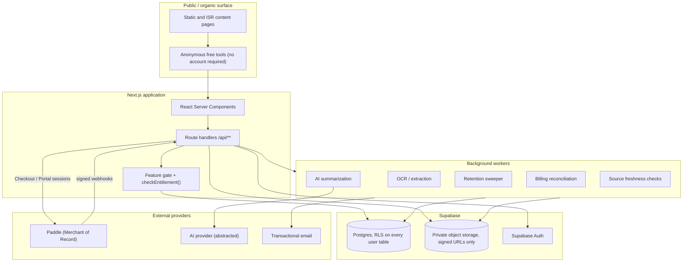
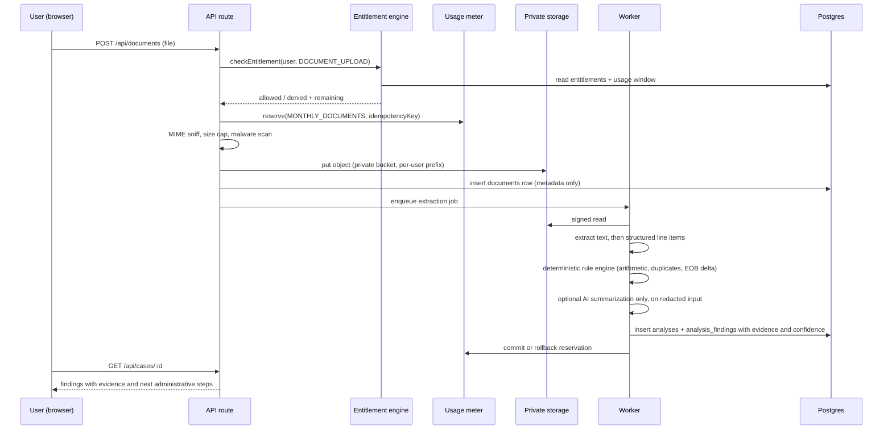
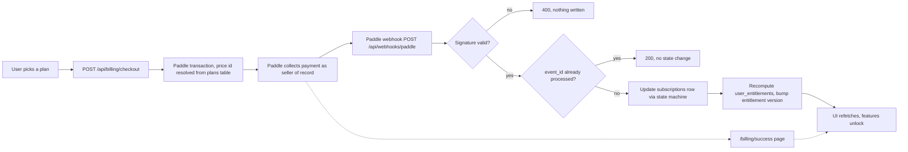
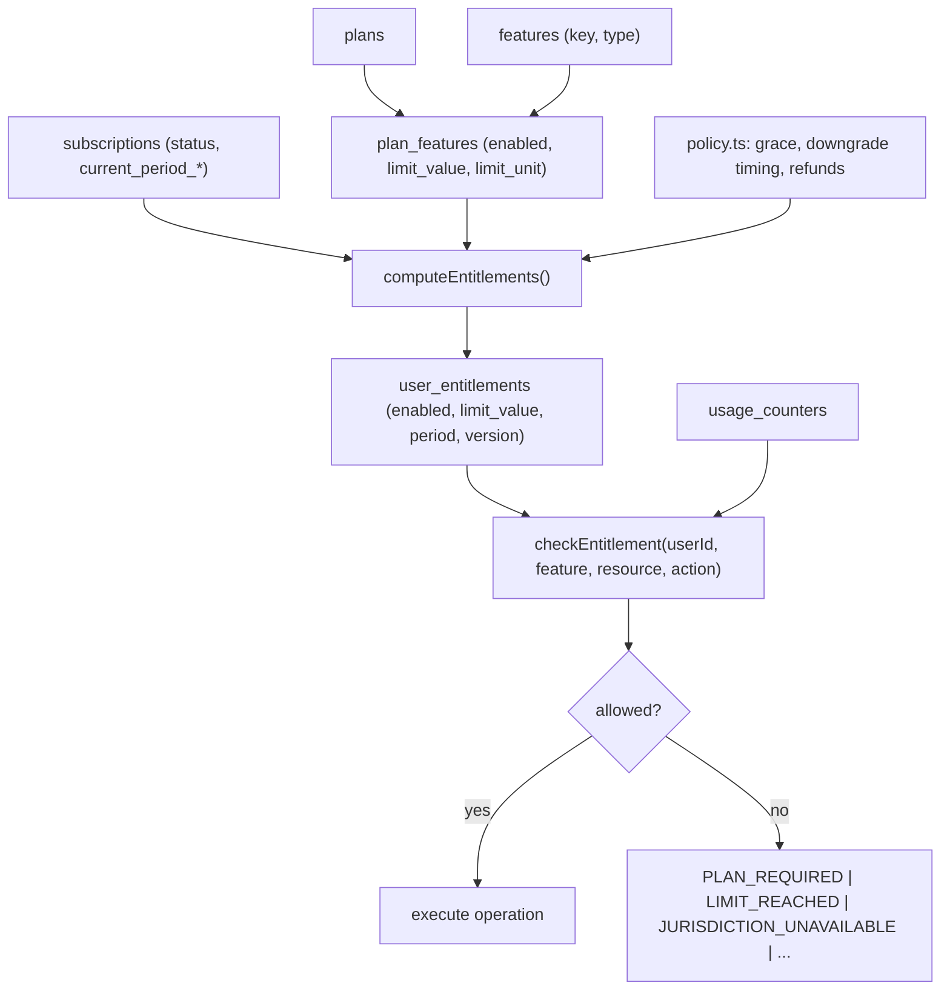
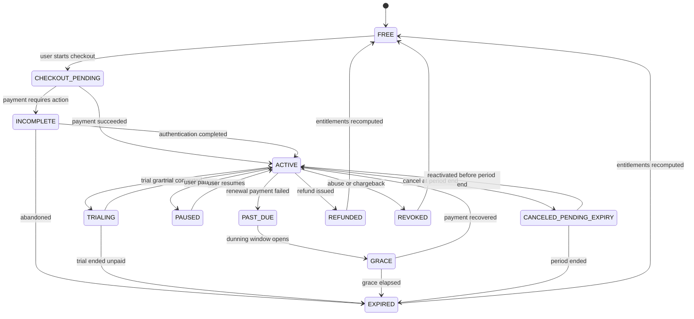
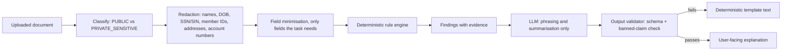
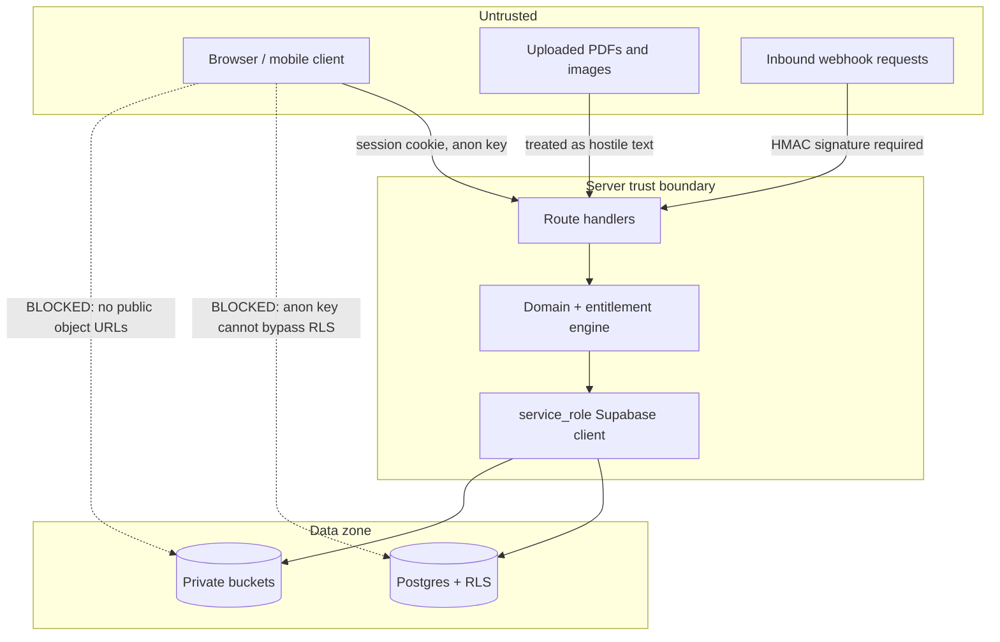

# ARCHITECTURE

Wintora is a consumer software utility that helps people in the United States and
Canada understand, organize and act on healthcare bills and related
administrative paperwork.

It is **not** a law firm, medical provider, insurer, debt collector, government
agency, credit-repair business, or autonomous negotiation agent. It prepares
**drafts the user reviews and sends themselves**. See `docs/AI_SAFETY.md` and the
disclaimer system in `src/config/disclaimers.ts`.

---

## 1. Layering

Business logic never lives in UI components. Every layer below depends only on
layers beneath it.

```
+----------------------------------------------------------+
| Presentation      src/app/**, src/components/**           |  React server/client components
+----------------------------------------------------------+
| Application       src/app/api/**, server actions          |  request parsing, auth, orchestration
+----------------------------------------------------------+
| Authorization     src/domain/entitlements/**              |  checkEntitlement(), feature gates
| Billing           src/domain/billing/**                   |  subscription state machine
| Usage             src/domain/usage/**                     |  quota windows, atomic metering
+----------------------------------------------------------+
| Domain            src/domain/{analysis,letters,cases,     |  pure, deterministic, provider-free
|                   retention,redaction}                    |
+----------------------------------------------------------+
| Infrastructure    src/lib/{supabase,payments,ai,http}     |  adapters to external systems
+----------------------------------------------------------+
| Data              supabase/migrations/**                  |  Postgres + Row Level Security
+----------------------------------------------------------+
```

**Ports and adapters.** `src/domain/**` is pure TypeScript with no imports from
`src/lib/**` and no network access. Persistence is expressed as narrow port
interfaces (`EntitlementStore`, `UsageStore`, `BillingStore`). Production wires
Supabase adapters; tests wire in-memory fakes. This is what makes the
entitlement and metering matrices testable without a live database, and the
purity rule is enforced by `scripts/verify-sql-invariants.mjs`.

---

## 2. System architecture



---

## 3. Data flow: a document from upload to finding



The rule engine is deterministic and runs first. The AI layer may only *phrase*
what the rules already found: it can never introduce a finding. See
`docs/AI_SAFETY.md`, section "Output contract".

---

## 4. Billing flow



The dotted path is important: reaching `/billing/success` **never** grants
access. Entitlements change only on a signature-verified webhook or on
reconciliation against the provider API.

---

## 5. Entitlement flow



`computeEntitlements()` is a **pure function**: given a subscription snapshot, a
plan-feature matrix and policy, it returns the entitlement set. It is therefore
directly unit-testable across the full plan and lifecycle matrix
(`tests/entitlements.test.ts`).

---

## 6. Subscription state machine

See `docs/BILLING.md` section 3 for the full transition table and
`src/domain/billing/states.ts` for the executable definition.



---

## 7. AI pipeline



Uploaded document text is **untrusted data**, never instructions. See
`docs/THREAT_MODEL.md`, section "Prompt injection".

---

## 8. Security boundary



The anon key is safe in the browser only because RLS is enabled on every
user-scoped table. The `service_role` key is server-only and bypasses RLS; it is
never referenced from any client component. `npm run verify:secrets` enforces
this as a CI gate.

---

## 9. SEO architecture

Public content is generated from structured records (`content_pages`,
`jurisdictions`, `sources`), not from string substitution of a state name into a
template. Each published page carries a jurisdiction, its sources, and a
`last_verified_at` date. Private surfaces are `noindex`. See `docs/SEO.md`.

---

## 10. Technology choices and why

| Concern | Choice | Reason |
| --- | --- | --- |
| Framework | Next.js App Router + TypeScript strict | Server-first rendering for SEO pages; server components keep authorization off the client. |
| Database | Supabase Postgres | The data is deeply relational (user, subscription, plan, feature, entitlement, usage, case, document, finding, source). Quota consumption and billing state need real transactions. |
| Authorization | Application checks **plus** Row Level Security | Two independent layers. A bug in a route handler still cannot read another user's rows. |
| Storage | Supabase private buckets, short-lived signed URLs | No public object URLs for health-adjacent documents. |
| Payments | Paddle, behind a `PaymentProvider` port | Merchant of Record: legal seller, remits sales tax/VAT/GST, accepts individual sellers. Chosen because Stripe is invite-only in India and the operator is not a registered company. The port keeps the choice reversible. |
| AI | Provider abstraction (`src/lib/ai`) | Cost-level routing (basic vs advanced model) protects plan margin; the provider is swappable. |
| Jobs | Queue with idempotency keys | OCR, AI, retention and reconciliation must all be retry-safe. |

---

## 11. Repository map

```
docs/                architecture, billing, entitlements, security, privacy, AI safety, SEO, threat model
supabase/migrations/ ordered SQL: schema, functions, RLS policies, catalog seed
supabase/tests/      RLS isolation tests (require a live Postgres)
src/config/          feature registry, plan catalog, policy constants, disclaimers
src/domain/          pure business logic, no I/O
src/lib/             adapters: supabase, payments (Paddle), ai, http, logging, rate limiting
src/app/             routes: public content, tools, dashboard, billing, API handlers
tests/               vitest suites: entitlements, metering, state machine, webhooks, analysis, redaction, retention
scripts/             CI gates: SQL invariants, secret-leak scan
```

---

## 12. What this architecture deliberately does not do

- It does not send anything on the user's behalf. No email, no fax, no filing,
  no phone call, no payment to a provider.
- It does not decide legal or medical questions.
- It does not treat frontend state as an authorization input.
- It does not delete user data because a subscription lapsed.
- It does not train models on customer documents.
