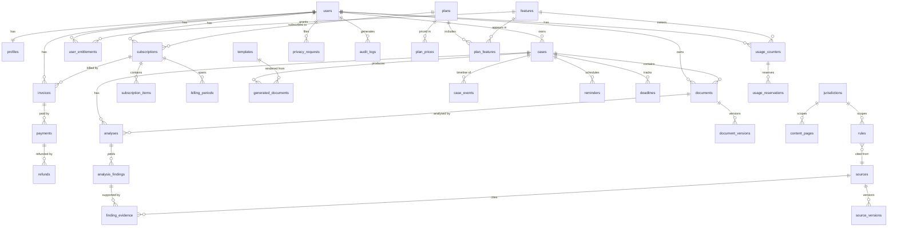

# DATABASE

Postgres, via Supabase. Chosen over a document store because essentially every
question the product asks is relational and several of them must be
transactional:

```
user -> subscription -> plan -> plan_features -> entitlement -> usage
user -> case -> document -> analysis -> finding -> evidence -> source -> jurisdiction
```

Quota consumption, billing state transitions, entitlement recomputation and
deletion jobs all need real transactions and row locking. Reporting needs joins.
Referential integrity needs foreign keys.

Migrations are ordered and forward-only, in `supabase/migrations/`. Each is
idempotent where practical (`create table if not exists`, `create or replace`) so
a partially applied migration can be re-run.

---

## 1. Conventions

- Primary keys are `uuid` defaulting to `gen_random_uuid()`.
- Timestamps are `timestamptz`, always UTC, named `*_at`.
- Money is stored as integer **minor units** (`amount_cents`) plus a
  `currency char(3)`. No floats touch money anywhere.
- Every user-scoped table has a non-null `user_id references auth.users(id) on delete cascade`.
- Every user-scoped table has RLS enabled and a deny-by-default policy set.
- Soft delete uses `deleted_at`; hard deletion is performed by the deletion job.
- Enum-like values use Postgres `create type ... as enum` so bad values cannot be
  written.
- `updated_at` is maintained by the `set_updated_at()` trigger, not by
  application code.

---

## 2. Entity relationships



---

## 3. Table inventory

### Identity

| Table | Purpose |
| --- | --- |
| `profiles` | One row per `auth.users` id. Display name, country (`US`/`CA`), region code, locale, timezone, onboarding state. **No clinical data.** |
| `user_roles` | Staff role assignments. Separate from `profiles` so a compromised profile write cannot grant a role. |

### Catalog (billing configuration as data)

| Table | Purpose |
| --- | --- |
| `plans` | slug, display name, description, version, active, country scope, billing interval, provider product id, sort order, `effective_from`, `effective_until`. |
| `plan_prices` | One row per plan per currency: `currency`, `amount_cents`, `provider_price_id`, `tax_behavior`. Enables USD and CAD without FX conversion. |
| `features` | key, name, description, `type` (BOOLEAN / LIMIT / QUOTA / RETENTION / SUPPORT_LEVEL), `cost_level`, customer-facing benefit sentence, active. |
| `plan_features` | `(plan_id, feature_id)` with `enabled`, `limit_value`, `limit_unit`. The plan matrix. |

### Billing

| Table | Purpose |
| --- | --- |
| `billing_customers` | Maps a user to a `provider_customer_id`. Unique per provider. |
| `subscriptions` | The lifecycle record. See section 4. |
| `subscription_items` | Provider item ids and quantities. |
| `billing_periods` | Materialised period rows used to anchor quota windows and to keep history after a period rolls. |
| `invoices` | provider id, number, amount, currency, status, hosted url, pdf url, period, timestamps. |
| `payments` | provider payment intent id, amount, currency, status, safe card metadata only (brand, last4, exp month/year). |
| `refunds` | provider refund id, amount, currency, reason, `entitlement_effect`, `revoke_at`, timestamps. |
| `webhook_events` | Idempotency and audit for inbound provider events. See section 5. |
| `billing_reconciliations` | Detected mismatches between provider state and internal state. |

### Entitlements and usage

| Table | Purpose |
| --- | --- |
| `user_entitlements` | Materialised entitlement cache: `(user_id, feature_id)` with `enabled`, `limit_value`, `source_plan_id`, `period_start`, `period_end`, `effective_at`, `expires_at`, `version`. |
| `entitlement_versions` | One row per user holding the current monotonic version counter. |
| `usage_counters` | `(user_id, feature_id, period_start, period_end)` with `used` and `limit_value`. Unique on that tuple. |
| `usage_reservations` | `idempotency_key` unique. Links a reservation to a counter, with `status` of RESERVED / COMMITTED / ROLLED_BACK. |

### Cases and documents

| Table | Purpose |
| --- | --- |
| `cases` | title, provider name, bill type, `amount_cents`, currency, country, jurisdiction, status, `service_date`, `statement_date`, archived flag. |
| `case_members` | Household support: which profile a case is about, for Pro plans. |
| `documents` | Metadata **only**. `storage_path`, `mime_type`, `byte_size`, `sha256`, `document_type`, `scan_status`, `extraction_status`, `retention_until`. Never the file bytes, never the extracted clinical text. |
| `document_versions` | Re-uploads and corrections. |
| `document_extractions` | Structured extraction output (line items, totals, dates) with a per-field confidence. Encrypted at rest by the storage layer; access is audited. |
| `analyses` | One analysis run: type, engine version, status, `started_at`, `completed_at`, cost level, model used, reservation id. |
| `analysis_findings` | code, severity, title, plain-language explanation, `confidence`, `recommended_action`, `is_ai_generated` (always false for the finding itself). |
| `finding_evidence` | Where the finding came from: document id, page, field, values compared, and an optional `source_id` for a cited authority. |
| `generated_documents` | Letter drafts: template id, rendered content, status (DRAFT / USER_REVIEWED / FINALISED), `user_confirmed_at`, export format. |
| `templates` | Structured letter templates with typed field definitions, jurisdiction scope, review status. |
| `case_events` | The timeline. Only verified or user-entered events. |
| `reminders` | User-scheduled follow-ups. |
| `deadlines` | `is_verified`, `source_id`, `user_entered`. An unverified deadline is never rendered as a legal deadline. |

### Knowledge base

| Table | Purpose |
| --- | --- |
| `countries`, `regions`, `jurisdictions` | US states and Canadian provinces/territories with `enabled`, `processing_enabled`, `publishing_enabled` kill switches. |
| `authorities` | Regulators, ombuds offices and agencies per jurisdiction. |
| `sources` | Authoritative documents with a `tier` (1 federal, 2 state/provincial, 3 regulator, 4 court, 5 insurer/provider, 6 recognised nonprofit, 7 reputable secondary), url, publisher. |
| `source_versions` | Fetched snapshots with content hash, `fetched_at`, `changed` flag. |
| `rules` | Jurisdiction-scoped administrative rules with `effective_from`, `effective_until`, `source_id`, `review_status`. |
| `content_pages` | Public pages: slug, topic, jurisdiction, blocks, FAQ, `review_status`, `last_verified_at`, `noindex`. |
| `content_page_versions` | Every published version, for rollback. |

### Operations, privacy, safety

| Table | Purpose |
| --- | --- |
| `audit_logs` | actor, action, resource type and id, outcome, request id, ip hash, user agent hash. Never payloads. |
| `security_events` | Typed security signals: invalid webhook signature, cross-user access attempt, illegal billing transition, quota bypass attempt, prompt-injection detection. |
| `support_access_grants` | Time-limited, user-granted, reason-required support access to a specific case. |
| `privacy_requests` | ACCESS / EXPORT / DELETE / CORRECT with jurisdiction, verification status, due date. |
| `deletion_jobs`, `export_jobs` | Asynchronous fulfilment with idempotency and status. |
| `jobs` | Generic queue: type, payload reference, idempotency key, attempts, status, error class. |
| `feature_flags` | Runtime flags including the global `SAFE_MODE`. |
| `system_settings` | Key-value operational settings. |
| `referrals` | code, referrer, referred user, qualified activation, reward status. |
| `corrections` | User-reported content problems, each becoming a review item. |
| `support_tickets` | Support routing with a category so billing staff never need document access. |

---

## 4. `subscriptions`

```sql
create table subscriptions (
  id                        uuid primary key default gen_random_uuid(),
  user_id                   uuid not null references auth.users(id) on delete cascade,
  provider                  billing_provider not null default 'paddle',
  provider_customer_id      text not null,
  provider_subscription_id  text unique,
  plan_id                   uuid not null references plans(id),
  status                    subscription_status not null default 'FREE',
  country                   char(2) not null,
  currency                  char(3) not null,
  billing_interval          billing_interval not null default 'month',
  amount_cents              integer not null default 0,
  provider_price_id         text,
  current_period_start      timestamptz,
  current_period_end        timestamptz,
  cancel_at_period_end      boolean not null default false,
  canceled_at               timestamptz,
  trial_start               timestamptz,
  trial_end                 timestamptz,
  grace_period_end          timestamptz,
  pause_start               timestamptz,
  pause_end                 timestamptz,
  pending_plan_id           uuid references plans(id),
  pending_plan_effective_at timestamptz,
  provider_object_updated_at timestamptz,
  created_at                timestamptz not null default now(),
  updated_at                timestamptz not null default now()
);
```

`provider_object_updated_at` is what makes out-of-order webhooks safe: a handler
refuses to apply an event whose provider timestamp is older than the stored one.

Partial unique index: at most one non-terminal subscription per user.

```sql
create unique index subscriptions_one_live_per_user
  on subscriptions (user_id)
  where status in ('CHECKOUT_PENDING','INCOMPLETE','TRIALING','ACTIVE',
                   'PAST_DUE','GRACE','PAUSED','CANCELED_PENDING_EXPIRY');
```

---

## 5. `webhook_events`

```sql
create table webhook_events (
  id                  uuid primary key default gen_random_uuid(),
  provider            billing_provider not null,
  event_id            text not null,
  event_type          text not null,
  status              webhook_status not null default 'RECEIVED',
  attempt_count       integer not null default 0,
  payload_hash        text not null,
  provider_created_at timestamptz,
  received_at         timestamptz not null default now(),
  processed_at        timestamptz,
  error_class         text,
  unique (provider, event_id)
);
```

The unique constraint is the idempotency mechanism. The handler inserts first;
a unique violation means redelivery and the handler returns 200 without
reapplying anything. `payload_hash` is a SHA-256 of the raw body, so a
tampered replay of a known event id is detectable. The payload itself is not
stored, because provider payloads contain billing identifiers that do not need to
live in the application database.

---

## 6. Atomic usage consumption

`supabase/migrations/0011_functions_usage_atomic.sql` defines
`consume_usage(p_user_id, p_feature_key, p_amount, p_idempotency_key, p_period_start, p_period_end, p_limit)`
as `security definer`, `search_path = public`:

1. Look up an existing `usage_reservations` row by idempotency key. If found,
   return its recorded result and consume nothing.
2. `insert ... on conflict do nothing` then `select ... for update` on the
   `usage_counters` row for the period, serialising concurrent callers.
3. If `limit_value` is not null and `used + p_amount > limit_value`, return
   `LIMIT_REACHED` without incrementing.
4. Otherwise increment `used`, insert the reservation, and return `ALLOWED` with
   the remaining balance.

`commit_usage(reservation_id)` marks a reservation `COMMITTED`.
`rollback_usage(reservation_id)` marks it `ROLLED_BACK` and decrements the
counter, clamped at zero, but only if it is still `RESERVED`. Both are
idempotent.

---

## 7. Row Level Security

Every user-scoped table follows the same shape:

```sql
alter table cases enable row level security;
alter table cases force row level security;

create policy cases_select_own on cases
  for select using (user_id = (select auth.uid()));
create policy cases_insert_own on cases
  for insert with check (user_id = (select auth.uid()));
create policy cases_update_own on cases
  for update using (user_id = (select auth.uid()))
              with check (user_id = (select auth.uid()));
create policy cases_delete_own on cases
  for delete using (user_id = (select auth.uid()));
```

Notes that matter:

- `force row level security` means the table owner is also subject to policies.
- `(select auth.uid())` rather than a bare `auth.uid()` lets the planner treat it
  as a stable initplan instead of evaluating per row.
- Child tables verify ownership through their parent with an `exists` subquery
  against the parent policy, so a forged `case_id` cannot attach a row to another
  user.
- Billing-configuration tables (`plans`, `plan_prices`, `features`,
  `plan_features`) are readable by any authenticated user because the pricing
  page needs them, and writable only by `service_role`.
- `webhook_events`, `security_events`, `audit_logs`, `billing_reconciliations`
  and `jobs` have **no** user-facing policies. They are `service_role` only.
- The `service_role` key bypasses RLS entirely, so it is server-only and never
  reaches a browser bundle. That is a hard rule enforced by
  `npm run verify:secrets`.

`supabase/tests/rls_isolation.sql` runs the adversarial matrix against a live
database: user A attempting to read, update or delete user B cases, documents,
analyses, generated documents, invoices, entitlements and usage counters, plus
attempts to insert a child row pointing at another user parent. Every one must
return zero rows or an error.

---

## 8. Storage

Files live in a private Supabase Storage bucket, never in Postgres. Object keys
are `{user_id}/{case_id}/{document_id}.{ext}`, so a storage policy scoped to the
first path segment gives the same isolation as RLS. There are no public URLs;
reads use short-lived signed URLs issued only after an ownership check, and each
issue is written to `audit_logs`.

`documents` stores metadata and a `sha256` content hash, which doubles as
duplicate-upload detection.

---

## 9. Indexes

Beyond the primary and unique keys:

```
cases                (user_id, status, created_at desc)
documents            (user_id, case_id), (retention_until) where deleted_at is null
analyses             (case_id, created_at desc), (status) where status = 'PENDING'
analysis_findings    (analysis_id, severity)
generated_documents  (case_id, created_at desc)
subscriptions        (user_id), (provider_subscription_id), (status), (current_period_end)
invoices             (user_id, created_at desc), (subscription_id)
user_entitlements    (user_id, feature_id) unique, (user_id, version)
usage_counters       (user_id, feature_id, period_start) unique
usage_reservations   (idempotency_key) unique, (counter_id, status)
webhook_events       (provider, event_id) unique, (status, received_at)
audit_logs           (user_id, created_at desc), (action, created_at desc)
content_pages        (slug) unique, (jurisdiction_id, topic), (review_status)
jobs                 (status, run_after), (idempotency_key) unique
```

---

## 10. Migration discipline

- Forward-only, ordered, checked into the repository.
- Additive first: add a nullable column, backfill, then constrain. Never a
  destructive change in the same migration as a deploy that depends on it.
- Billing schema changes ship behind a feature flag and are reconciled before
  the old path is removed.
- Every migration is reviewed for its effect on RLS. Adding a table without RLS
  fails `npm run verify:sql`, which greps every `create table` in
  `supabase/migrations/` for a matching `enable row level security` or an
  explicit `-- rls-exempt:` annotation with a stated reason.
